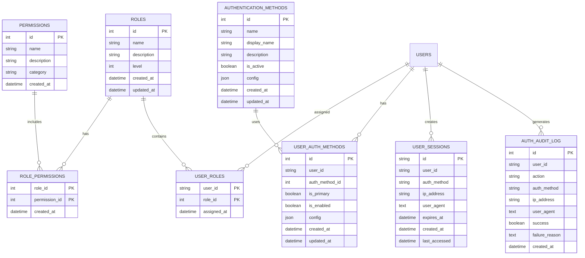

```mermaid
erDiagram
    ROLES ||--o{ ROLE_PERMISSIONS : has
    PERMISSIONS ||--o{ ROLE_PERMISSIONS : includes
    USERS ||--o{ USER_ROLES : assigned
    ROLES ||--o{ USER_ROLES : contains
    AUTHENTICATION_METHODS ||--o{ USER_AUTH_METHODS : uses
    USERS ||--o{ USER_AUTH_METHODS : has
    USERS ||--o{ USER_SESSIONS : creates
    USERS ||--o{ AUTH_AUDIT_LOG : generates

    ROLES {
        int id PK
        string name
        string description
        int level
        datetime created_at
        datetime updated_at
    }

    PERMISSIONS {
        int id PK
        string name
        string description
        string category
        datetime created_at
    }

    ROLE_PERMISSIONS {
        int role_id PK
        int permission_id PK
        datetime created_at
    }

    USER_ROLES {
        string user_id PK
        int role_id PK
        datetime assigned_at
    }

    AUTHENTICATION_METHODS {
        int id PK
        string name
        string display_name
        string description
        boolean is_active
        json config
        datetime created_at
        datetime updated_at
    }

    USER_AUTH_METHODS {
        int id PK
        string user_id
        int auth_method_id
        boolean is_primary
        boolean is_enabled
        json config
        datetime created_at
        datetime updated_at
    }

    USER_SESSIONS {
        string id PK
        string user_id
        string auth_method
        string ip_address
        text user_agent
        datetime expires_at
        datetime created_at
        datetime last_accessed
    }

    AUTH_AUDIT_LOG {
        int id PK
        string user_id
        string action
        string auth_method
        string ip_address
        text user_agent
        boolean success
        text failure_reason
        datetime created_at
    }
```
```